# Claude Multi-Agent System

## 概要

**Claude Multi-Agent System**は、複数のAIエージェントが協力してプロジェクトを進行する革新的なシステムです。
President/Boss/Worker の3層構造を実装しています。

## システム構成

### 🏢 組織構造

```
👑 PRESIDENT（最高経営者）
    ↓ 指示・ビジョン策定
🎯 BOSS（チームリーダー）
    ↓ タスク分解・配分
┌─────────────────────────────────────────┐
│ 🎨 WORKER1  │ ⚙️ WORKER2  │ 🧪 WORKER3  │
│ UI/UX      │ Backend    │ Test       │
│ デザイン担当  │ データ処理担当 │ 品質保証担当  │
└─────────────────────────────────────────┘
```

### 📋 各ロールの詳細

| ロール | 担当領域 | 主な責務 | ドキュメント |
|--------|----------|----------|--------------|
| 👑 **PRESIDENT** | 統括・意思決定 | ビジョン策定、戦略決定、品質管理 | `president/president.md` |
| 🎯 **BOSS** | チーム管理 | タスク分解、進捗管理、品質保証 | `boss/boss.md` |
| 🔧 **WORKER1** | 汎用開発 | フルスタック開発、柔軟な専門性 | `worker/worker.md` |
| 🔧 **WORKER2** | 汎用開発 | フルスタック開発、柔軟な専門性 | `worker/worker.md` |
| 🔧 **WORKER3** | 汎用開発 | フルスタック開発、柔軟な専門性 | `worker/worker.md` |

## 🎯 使用パターン

このシステムは**2つの主要な使用パターン**に対応しています：

### 📋 パターン1: AI President主導型

**AI Presidentに指示を出し、BOSSやWorkerに作業を譲渡する自動化パターン**

```mermaid
graph TD
    A[👤 あなた] --> B[👑 AI President]
    B --> C[🎯 AI Boss]
    C --> D[🔧 AI Worker1]
    C --> E[🔧 AI Worker2]
    C --> F[🔧 AI Worker3]
```



**特徴**:
- 高レベルの要求を伝えるだけで自動的にタスク分解
- AI同士の協調による効率的な開発
- 人間の介入を最小限に抑制

### 🎯 パターン2: 人間President主導型

**あなたがPresidentとして方式案を明文化し、BossとしてWorkerに具体的指示を出すパターン**

```mermaid
graph TD
    A[👤 あなた = President] --> B[📋 planlist.md作成]
    A --> C[🎯 あなた = Boss]
    C --> D[🔧 AI Worker1]
    C --> E[🔧 AI Worker2]
    C --> F[🔧 AI Worker3]
```



**特徴**:
- 詳細な要件定義と方式案の事前策定
- 人間の判断による精密な指示・管理
- より確実性の高い成果物の実現

---

## 🚀 クイックスタート（任意のプロジェクト向け）

### 前提条件

- Git がインストールされていること
- tmux がインストールされていること
- Claude CLI がインストール・認証済みであること

### セットアップ手順

#### 1. Claude Multi-Agent System のクローン

```bash
# 方法1: ツールディレクトリにクローン（推奨）
mkdir -p ~/tools
cd ~/tools
git clone https://github.com/your-repo/claude-multi-agent-system.git

# PATHに追加
export PATH=$PATH:~/tools/claude-multi-agent-system/scripts
```

#### 2. プロジェクトの初期化（新機能！）

```bash
# 任意のプロジェクトで実行
cd /path/to/your-project
claude-multi-agent-init.sh

# または、カスタムオプション付き
claude-multi-agent-init.sh --workers 2 --model claude-4o-latest
```

#### 3. プロジェクトの設定（従来の方法）

```bash
# 開発したいプロジェクトに移動
cd /path/to/your/project

# 設定を初期化（対話形式）
~/tools/claude-multi-agent-system/scripts/config-manager.sh init
```

#### 3. Git Worktree のセットアップ

```bash
# 設定に基づいてWorktreeを作成
~/tools/claude-multi-agent-system/scripts/worktree-config.sh setup
```

#### 4. tmux セッションとAIエージェントの起動

```bash
cd ~/tools/claude-multi-agent-system/scripts
./setup-multiagent.sh    # tmuxセッション作成
./quick-start-multiagent.sh  # AIエージェント起動
```

#### 5. システム接続

```bash
tmux attach-session -t multiagent
```

### 🤖 パターン1: AI President主導型の開始

#### 4a. AI Presidentに高レベル指示

PRESIDENTウィンドウで以下を入力：

```
あなたはpresidentです。
革新的なTODOアプリを作成してください。
シンプルで使いやすく、モダンなデザインを重視してください。

【基本要件】
- タスクの追加・編集・削除
- 進捗管理機能
- レスポンシブデザイン

【成功基準】
- 直感的な操作性
- 3秒以内のページ読み込み
- 全デバイス対応

BOSSとWorkerに適切にタスクを分解・配布してください。
```

### 👨‍💼 パターン2: 人間President主導型の開始

#### 4b-1. 方式案の事前策定（planlist.md作成）

```bash
# planlist.mdを編集
vim ../planlist.md
```

planlist.mdの例：
```markdown
# TODOアプリ開発 - 方式案

## 方式案1: React + TypeScript + Supabase
**概要**: モダンなフロントエンド重視のアプローチ
**技術スタック**: React, TypeScript, Tailwind CSS, Supabase
**担当Worker**: worker1

### 実装要件
1. React 18 + TypeScript環境構築
2. Tailwind CSSでのレスポンシブデザイン
3. Supabaseでのバックエンド連携
4. PWA対応

## 方式案2: Next.js + Prisma + PostgreSQL  
**概要**: フルスタック開発でのパフォーマンス重視
**技術スタック**: Next.js, Prisma, PostgreSQL, Vercel
**担当Worker**: worker2

### 実装要件
1. Next.js 14環境構築
2. Prisma ORM設定
3. PostgreSQL データベース設計
4. Vercelデプロイ設定

## 方式案3: Vue.js + Firebase + PWA
**概要**: リアルタイム機能重視のモバイルファースト
**技術スタック**: Vue.js 3, Firebase, PWA
**担当Worker**: worker3

### 実装要件  
1. Vue.js 3 Composition API
2. Firebase Realtime Database
3. PWA機能実装
4. オフライン対応
```

#### 4b-2. Boss権限での方式案分配

```bash
# 方式案を自動分配
./boss-commander.sh assign

# または個別分配
./boss-commander.sh assign worker1 1
./boss-commander.sh assign worker2 2  
./boss-commander.sh assign worker3 3
```

#### 4b-3. 具体的な開発指示

```bash
# Worker1への具体的指示
./boss-commander.sh instruct worker1
# 入力例：
# React + TypeScriptでTODOアプリのフロントエンドを実装してください。
# Tailwind CSSを使用し、レスポンシブ対応してください。
# コンポーネント設計は再利用性を重視してください。

# Worker2への具体的指示  
./boss-commander.sh instruct worker2
# 入力例：
# Next.js + Prismaでバックエンド機能を実装してください。
# CRUD操作のAPIエンドポイントを作成してください。
# PostgreSQLスキーマ設計も含めてください。

# Worker3への具体的指示
./boss-commander.sh instruct worker3  
# 入力例：
# Vue.js + FirebaseでPWA対応のTODOアプリを実装してください。
# リアルタイム同期機能を含めてください。
# オフライン時の動作も考慮してください。
```

## 🎮 操作方法

### 画面構成

```
ウィンドウ0: 👑 PRESIDENT
┌─────────────────────────────────────────┐
│                                         │
│         👑 PRESIDENT                    │
│         統括・意思決定                    │
│                                         │
└─────────────────────────────────────────┘

ウィンドウ1: チーム（4分割）
┌─────────────────┬─────────────────┐
│   🎯 BOSS       │  🎨 WORKER1     │
│   チーム管理     │  UI/UX         │
├─────────────────┼─────────────────┤
│  ⚙️ WORKER2     │  🧪 WORKER3     │
│  Backend       │  Test          │
└─────────────────┴─────────────────┘
```

### キーボード操作

- `Ctrl+B → 0` : PRESIDENTウィンドウに切り替え
- `Ctrl+B → 1` : チームウィンドウに切り替え
- `Ctrl+B → 矢印` : ペイン間移動
- `Ctrl+B → d` : セッションからデタッチ

## 🆕 新機能（改善版）

### 📊 リアルタイム進捗モニター

```bash
# プロジェクトの進捗をリアルタイムで監視
./monitor-dashboard.sh

# 更新間隔を指定（デフォルト: 5秒）
./monitor-dashboard.sh --interval 10
```

### 📋 柔軟なPlanlist解析

```bash
# 様々なフォーマットのplanlist.mdを解析
./planlist-parser.sh parse /path/to/planlist.md

# タスクを自動的にWorkerに割り当て
./planlist-parser.sh assign /path/to/planlist.md

# 現在の割り当て状況を確認
./planlist-parser.sh check
```

### 🚀 簡単初期化スクリプト

```bash
# 任意のプロジェクトで一発初期化
cd /your/project
claude-multi-agent-init.sh

# カスタマイズ例
claude-multi-agent-init.sh --workers 2 --model claude-4o-latest
```

## 📤 メッセージ送信

### agent-send.sh の使用

```bash
# 個別送信
./agent-send.sh president "新しいプロジェクトを開始します"
./agent-send.sh boss "タスクを3つに分解してください"
./agent-send.sh worker1 "ログイン画面のUIを作成してください"

# 一括送信
./agent-send.sh team "進捗を報告してください"
./agent-send.sh all "全員集合！"
```

### 送信先一覧

| 送信先 | 対象 | 説明 |
|--------|------|------|
| `president` | 👑 PRESIDENT | 統括責任者 |
| `boss` | 🎯 BOSS | チームリーダー |
| `worker1` | 🔧 WORKER1 | 汎用開発担当 |
| `worker2` | 🔧 WORKER2 | 汎用開発担当 |
| `worker3` | 🔧 WORKER3 | 汎用開発担当 |
| `team` | 🏢 チーム | BOSS + WORKER1-3 |
| `all` | 🌐 全員 | 全エージェント |

## 💡 使用例

### 🤖 パターン1: AI President主導型の使用例

#### 1. Webアプリケーション開発（AI President主導）

```bash
# PRESIDENT → 高レベル指示（AI Presidentが自動でタスク分解・配布）
./agent-send.sh president "
あなたはpresidentです。
オンライン書店のWebアプリケーションを開発してください。

【要求仕様】
- 書籍検索・購入機能
- ユーザー登録・ログイン
- 購入履歴管理
- レスポンシブデザイン

【成功基準】
- 3クリック以内で購入完了
- ページ読み込み2秒以内
- 全デバイス対応

BOSSとWorkerに適切にタスクを分解・配布し、
革新的なアプローチで実現してください。
"
```

#### 2. AI同士の協調確認

```bash
# AI President → AI Boss → AI Workersの連携状況確認
./agent-send.sh president "現在のプロジェクト進捗を確認し、必要に応じてBOSSとWorkerに指示を出してください"
```

### 👨‍💼 パターン2: 人間President主導型の使用例

#### 1. 方式案ベースの開発指示

```bash
# planlist.mdを事前作成後、Boss権限で分配
./boss-commander.sh analyze    # 方式案分析
./boss-commander.sh assign     # 自動分配

# または個別分配
./boss-commander.sh assign worker1 1  # 方式案1をworker1に
./boss-commander.sh assign worker2 2  # 方式案2をworker2に
./boss-commander.sh assign worker3 3  # 方式案3をworker3に
```

#### 2. 具体的開発指示（Boss権限）

```bash
# Worker1への詳細指示
./boss-commander.sh instruct worker1 "
React + TypeScriptでオンライン書店のフロントエンドを実装してください。

【担当範囲】
- 書籍検索画面のUI実装
- ユーザー登録・ログイン画面
- 購入カート機能
- レスポンシブデザイン対応

【技術要件】
- React 18 + TypeScript
- Tailwind CSS使用
- コンポーネント設計は再利用性重視
- アクセシビリティ対応（WCAG 2.1 AA）

【成果物】
- 完動するReactアプリケーション
- コンポーネント設計書
- UIテストコード
"

# Worker2への詳細指示
./boss-commander.sh instruct worker2 "
Next.js + Prismaでバックエンド機能を実装してください。

【担当範囲】
- REST API設計・実装
- データベース設計
- 認証・認可システム
- 決済処理連携

【技術要件】
- Next.js 14 API Routes
- Prisma ORM + PostgreSQL
- JWT認証
- Stripe決済連携

【成果物】
- 完動するAPIサーバー
- データベーススキーマ
- API仕様書
- 単体テストコード
"
```

#### 3. 進捗管理と品質確認

```bash
# 全Worker進捗確認
./boss-commander.sh check

# 個別レビュー
./boss-commander.sh review worker1
./boss-commander.sh review worker2  
./boss-commander.sh review worker3

# フィードバック
./boss-commander.sh feedback worker1 "
フロントエンド実装、素晴らしい出来です！

【良い点】
- コンポーネント設計が適切
- レスポンシブ対応完璧
- アクセシビリティ配慮

【改善点】
- パフォーマンス最適化をお願いします
- エラーハンドリングの強化
- ローディング状態の改善

次のフェーズに進んでください。
"
```

### 🔄 共通の運用例

#### 進捗確認

```bash
# チーム全体に進捗確認
./agent-send.sh team "現在の進捗状況を報告してください"

# 個別確認
./agent-send.sh worker1 "担当タスクの進捗を詳しく報告してください"
./agent-send.sh worker2 "現在の課題と解決策を教えてください"
./agent-send.sh worker3 "完了予定時刻を教えてください"
```

#### 緊急対応

```bash
# 全員への緊急指示
./agent-send.sh all "【緊急】セキュリティ脆弱性が発見されました。作業を一時停止し、対応策を検討してください"

# Boss経由での調整
./boss-commander.sh coordinate "worker1とworker2の連携を強化し、API仕様の齟齬を解決してください"
```

## 📁 プロジェクト構成

```
claude_multi_agent_system/
├── president/
│   └── president.md          # PRESIDENT役割定義
├── boss/
│   └── boss.md              # BOSS役割定義
├── worker/
│   └── worker.md            # WORKER汎用役割定義
├── scripts/
│   ├── setup-multiagent.sh      # tmuxセッションセットアップ
│   ├── quick-start-multiagent.sh # AIエージェント起動
│   ├── config-manager.sh        # 設定管理（NEW）
│   ├── worktree-config.sh       # Worktree管理（NEW）
│   ├── assignment-manager.sh    # タスク分配管理（NEW）
│   ├── agent-send.sh            # メッセージ送信
│   ├── boss-commander.sh        # Boss操作パネル
│   ├── progress-tracker.sh      # 進捗管理
│   └── parallel-dev-manager.sh  # 並列開発管理
├── config/
│   └── project.config.example   # 設定ファイルテンプレート
├── assignments/                 # タスク分配（タイムスタンプ管理）
│   ├── 20250625/               # 日付別フォルダ
│   │   └── 174532/             # タイムスタンプ別フォルダ
│   │       ├── worker1_approach_1.md
│   │       └── ...
│   └── current -> ...          # 最新分配へのシンボリックリンク
├── reports/                    # レポート（タイムスタンプ管理）
│   └── 20250625/
│       └── 174532/
├── logs/                       # ログファイル
├── docs/
│   └── CONFIGURATION_GUIDE.md  # 設定ガイド
└── README.md                   # このファイル

## 作業ディレクトリ構成（プロジェクト側）

your-project/
├── .claude-multi-agent/        # プロジェクト固有設定
│   └── project.config         # プロジェクト設定ファイル
├── worktrees/                 # Worker別Git Worktree
│   ├── worker1/               # feature/worker-worker1-dev
│   ├── worker2/               # feature/worker-worker2-dev
│   └── worker3/               # feature/worker-worker3-dev
└── planlist.md               # 方式案リスト

## 中間成果物（/tmp）

/tmp/worker-outputs/
├── worker1/
│   └── 20250625_174532/       # タイムスタンプ別作業ディレクトリ
│       ├── src/               # ソースコード
│       ├── docs/              # ドキュメント
│       ├── tests/             # テストコード
│       └── build/             # ビルド成果物
├── worker2/
└── worker3/
```

## 🔄 開発ワークフロー

### 1. プロジェクトセットアップ（初回のみ）

```bash
# プロジェクトで設定初期化
cd /path/to/your/project
~/tools/claude-multi-agent-system/scripts/config-manager.sh init

# Worktree作成
~/tools/claude-multi-agent-system/scripts/worktree-config.sh setup
```

### 2. 開発サイクル

#### Step 1: 方式案作成（planlist.md）

```bash
# プロジェクトルートで planlist.md を作成
vim planlist.md
```

#### Step 2: タスク分配

```bash
cd ~/tools/claude-multi-agent-system/scripts

# tmuxセッション起動
./setup-multiagent.sh
./quick-start-multiagent.sh

# 方式案を分析・分配
./boss-commander.sh analyze
./boss-commander.sh assign
```

#### Step 3: 開発進行

```bash
# 進捗確認
./agent-send.sh team "進捗を報告してください"

# 個別指示
./agent-send.sh worker1 "UIコンポーネントの実装を開始してください"
```

#### Step 4: 成果物統合

```bash
# 各Workerの成果を確認
./worktree-config.sh status

# マージ準備
cd /path/to/your/project
git checkout main
git merge feature/worker-worker1-dev
```

### 3. ファイル管理

#### Assignments（タスク分配）

```bash
# 新しい分配は自動的にタイムスタンプ付きフォルダに保存
assignments/
├── 20250625/
│   ├── 103000/  # 10:30:00の分配
│   └── 153000/  # 15:30:00の分配
└── current -> 20250625/153000  # 最新へのリンク

# 古い分配をクリーンアップ（7日以上前）
./assignment-manager.sh clean 7
```

#### 中間成果物（/tmp）

```bash
# Workerは中間成果物を/tmpに保存
/tmp/worker-outputs/worker1/20250625_153000/
├── src/      # 作業中のソースコード
├── docs/     # 作業メモ
├── tests/    # テストコード
└── build/    # ビルド成果物

# 完成したら worktree にコミット
cd ~/project/worktrees/worker1
git add .
git commit -m "Complete implementation"
```

## 🔧 高度な機能

### 設定管理

```bash
# 設定確認
./config-manager.sh show

# 設定編集
./config-manager.sh edit

# 設定検証
./config-manager.sh validate

# 環境変数エクスポート
source <(./config-manager.sh export)
```

### タスク分配管理

```bash
# 分配履歴確認
./assignment-manager.sh list

# 古い分配のクリーンアップ
./assignment-manager.sh clean 30

# 分配のアーカイブ
./assignment-manager.sh archive
```

### 並列開発管理

```bash
# Worktree状態確認
./worktree-config.sh status

# ブランチ同期
./worktree-config.sh sync

# Worktreeクリーンアップ
./worktree-config.sh cleanup
```


## 🎯 ベストプラクティス

### 🤖 パターン1: AI President主導型のベストプラクティス

#### 1. 高レベル指示の明確化

```bash
# ✅ 良い例：構造化された高レベル指示
./agent-send.sh president "
あなたはpresidentです。
【プロジェクト名】タスク管理アプリ
【ビジョン】チームの生産性を3倍向上させる
【成功基準】
- タスク作成が10秒以内
- 進捗が一目で分かる
- 全デバイス対応

【期待する成果】
- BOSSとWorkerに適切なタスク分解
- 技術選定の理由説明
- 開発スケジュールの提案

革新的なアプローチで実現してください。
"

# ❌ 悪い例：曖昧な指示
./agent-send.sh president "何か作って"
```

#### 2. AI同士の協調を促進

```bash
# AI President → AI Boss → AI Workers の連携強化
./agent-send.sh president "
プロジェクト全体を俯瞰し、BOSSとWorkerの連携を最適化してください。
定期的に進捗を確認し、必要に応じて方向修正を行ってください。
"
```

### 👨‍💼 パターン2: 人間President主導型のベストプラクティス

#### 1. 詳細な方式案の事前策定

```markdown
# planlist.mdの構造化例
## 方式案1: [技術スタック名]
**概要**: [1行で概要説明]
**技術スタック**: [具体的な技術リスト]
**担当Worker**: [worker1/worker2/worker3]
**優先度**: [高/中/低]
**工数見積**: [時間単位]

### 実装要件
1. [具体的要件1]
2. [具体的要件2]
3. [具体的要件3]

### 成功基準
- [測定可能な基準1]
- [測定可能な基準2]

### リスク要因
- [想定されるリスク1]
- [想定されるリスク2]
```

#### 2. Boss権限での段階的指示

```bash
# ステップ1: 方式案分析・分配
./boss-commander.sh analyze
./boss-commander.sh assign

# ステップ2: 詳細指示
./boss-commander.sh instruct worker1 "[詳細な実装指示]"

# ステップ3: 進捗管理
./boss-commander.sh check
./boss-commander.sh review worker1

# ステップ4: フィードバック・調整
./boss-commander.sh feedback worker1 "[具体的なフィードバック]"
./boss-commander.sh coordinate "[調整指示]"
```

#### 3. 品質管理の徹底

```bash
# 定期的な品質チェック
./boss-commander.sh review worker1 "
以下の観点でレビューしてください：
- コード品質（可読性、保守性）
- パフォーマンス（速度、メモリ使用量）
- セキュリティ（脆弱性、認証）
- テスト（カバレッジ、品質）
"
```

### 🔄 共通ベストプラクティス

#### 1. 定期的な進捗確認

```bash
# パターン1: AI President主導
./agent-send.sh president "プロジェクト全体の進捗を確認し、必要な調整を行ってください"

# パターン2: 人間President主導  
./boss-commander.sh check
```

#### 2. 品質基準の明確化

各パターン共通の品質基準：

- **フロントエンド**: WCAG 2.1 AA準拠、3クリック以内での目的達成、レスポンス時間1秒以内
- **バックエンド**: API応答時間200ms以内、99.9%可用性、セキュリティ対策完備
- **テスト**: カバレッジ90%以上、自動化率80%以上、CI/CD対応

#### 3. コミュニケーション戦略

```bash
# 効果的なメッセージング
./agent-send.sh team "
【定期報告】
- 現在の進捗率
- 完了したタスク
- 次の課題
- 必要なサポート
を報告してください。
"

# 問題解決のための協調
./boss-commander.sh coordinate "
worker1とworker2で技術仕様の認識齟齬があります。
両者で話し合い、統一見解をまとめてください。
"
```

#### 4. 効率的な開発フロー

```bash
# パターン1: 自動化重視
./agent-send.sh president "効率的な開発フローを構築し、自動化できる部分は積極的に自動化してください"

# パターン2: 管理重視
./boss-commander.sh instruct all "
開発フローを以下に統一してください：
1. 要件確認
2. 設計レビュー  
3. 実装
4. テスト
5. レビュー
6. デプロイ
各段階で必ず報告してください。
"
```

## 🚨 トラブルシューティング

### よくある問題と解決法

1. **セッションが見つからない**
   ```bash
   ./setup-multiagent.sh  # 再セットアップ
   ```

2. **Claude認証エラー**
   - 各ペインでブラウザ認証を完了
   - `claude --dangerously-skip-permissions` を再実行

3. **メッセージが届かない**
   ```bash
   tmux list-sessions     # セッション確認
   tmux list-panes -t multiagent  # ペイン確認
   ```

4. **システムが重い**
   ```bash
   tmux kill-session -t multiagent  # セッション終了
   ./setup-multiagent.sh            # 再起動
   ```

## 📈 期待される効果

### 開発効率の向上

- **並列処理**: 3つの専門チームが同時作業
- **専門性活用**: 各分野のエキスパートが最適化
- **品質保証**: 段階的な品質チェック

### 成果物の品質向上

- **UI/UX**: ユーザー中心設計、アクセシビリティ対応
- **Backend**: 高性能・高可用性システム
- **Test**: 包括的テスト、継続的品質改善

### 学習・改善効果

- **ベストプラクティス**: 各分野の最新手法を活用
- **継続改善**: 定期的な振り返りと改善
- **ナレッジ共有**: チーム間での知識共有

## 🌟 まとめ

Claude Multi-Agent Systemは、**2つの使用パターン**で多様なニーズに対応：

### 🤖 パターン1: AI President主導型
- **高度な自動化**: AI同士の協調による自律的な開発
- **創発的なアイデア**: AI間の相互作用による革新的な提案
- **効率的な開発**: 人間の介入を最小限に抑えた高速開発

### 👨‍💼 パターン2: 人間President主導型  
- **精密な制御**: 詳細な要件定義による確実な成果物
- **戦略的な判断**: 人間の経験と判断による最適化
- **品質保証**: 段階的なレビューによる高品質な実装

### 🎯 共通の効果

両パターン共通で実現される効果：

- **3倍の開発速度**: 並列処理による効率化
- **10倍の品質**: 専門性を活かした品質保証  
- **革新的なアイデア**: 多角的な視点からの提案
- **柔軟な対応**: プロジェクトの性質に応じた最適なアプローチ

### 🔄 使い分けの指針

| 項目 | AI President主導型 | 人間President主導型 |
|------|-------------------|-------------------|
| **適用場面** | 探索的開発、アイデア創出 | 確実性重視、大規模開発 |
| **管理コスト** | 低い | 高い |
| **創発性** | 高い | 中程度 |
| **制御性** | 中程度 | 高い |
| **学習効果** | AI同士の学習 | 人間の経験蓄積 |

ぜひこのシステムを活用して、革新的なプロジェクトを成功させてください！

---

## 🚀 今すぐ始める

### パターン1: AI President主導型
```bash
cd claude_multi_agent_system/scripts
./setup-multiagent.sh && ./quick-start-multiagent.sh
tmux attach-session -t multiagent
# PRESIDENTウィンドウで高レベル指示を入力
```

### パターン2: 人間President主導型
```bash
cd claude_multi_agent_system/scripts
./setup-multiagent.sh && ./quick-start-multiagent.sh
# planlist.md を作成・編集
vim ../planlist.md
# Boss権限で方式案分配
./boss-commander.sh analyze && ./boss-commander.sh assign
tmux attach-session -t multiagent
```

**📚 詳細ガイド:** `WORKFLOW_GUIDE.md` と `QUICK_START.md` を参照

**💬 質問・要望:** Issues で気軽にお知らせください！ 